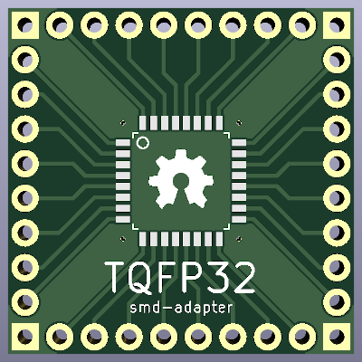

SMD adapter for TQFP32 packages
===============================

This project is a small smd-to-pin adapter for TQFP-32 packages. His goal is to
help using smd ic components during prototyping of electronic boards.

CAD sources
-----------

This board has been designed using KiCad EDA (version 7). All sources files
(schematics, routing, ...) are available into the `prj-kicad` folder.

License
-------

This project is OpenHardware. All materials are published and can be used
under terms of the CERN-OHL-S v2 license (see License.txt).
